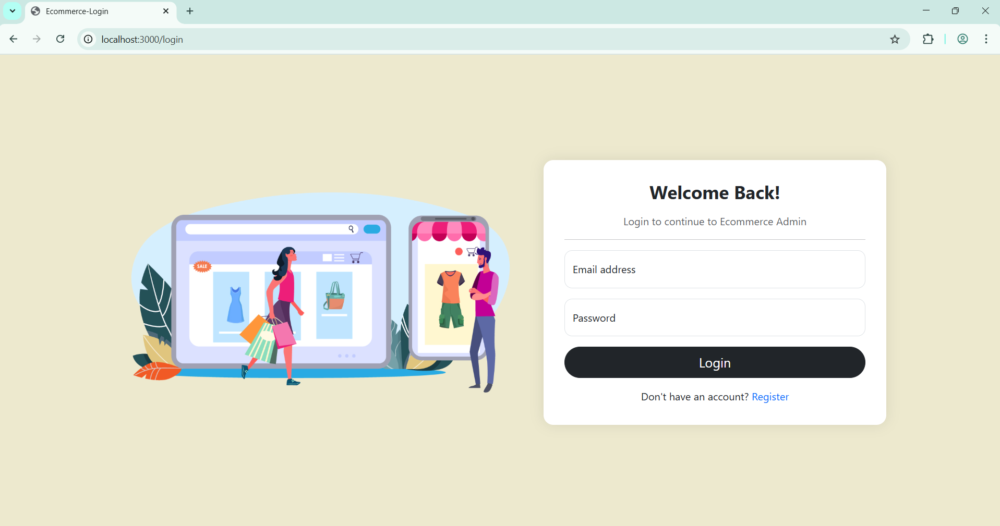
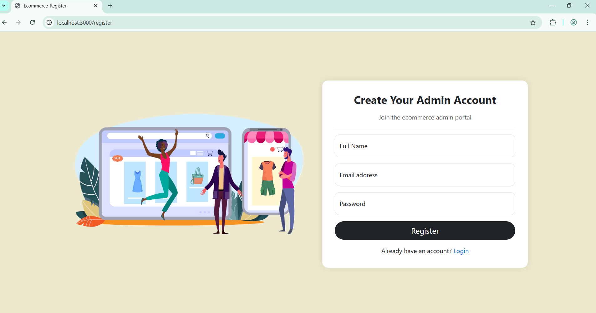
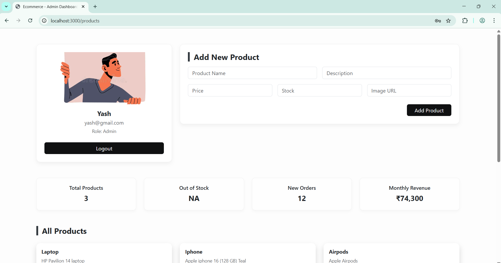
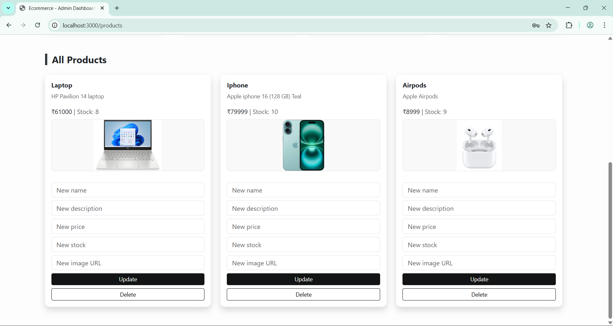

# 🛠️ Admin Product Dashboard

A secure and responsive admin dashboard for managing product listings with full authentication and CRUD functionality.

> Built using **Node.js**, **Express**, **MongoDB**, **HBS**, and **session-based authentication**.

---

## 🚀 Features

- 🔐 **User Authentication** (Signup & Login)
- 📦 **Product Management** – Add, update, delete, view
- 🧠 **Session Management** with `express-session`
- 🛡️ **Password Security** using `bcrypt`
- 🧱 **MongoDB Integration** with Mongoose
- 🎨 **Dynamic UI** using HBS templating

---

## 🧰 Tech Stack

| Category            | Tech Stack                          |
|---------------------|--------------------------------------|
| **Backend**         | Node.js, Express                     |
| **Database**        | MongoDB, Mongoose                    |
| **Templating**      | HBS                                  |
| **Auth & Security** | express-session, bcrypt              |
| **Misc**            | dotenv, body-parser, static assets   |

---

## 📸 Screenshots

Visual highlights of key features and interface:

<p align="center">
  
  <br><strong>🔐 Login Page</strong>
  <br>
</p>

<p align="center">
  
  <br><strong>📝 Signup Page</strong>
  <br>
</p>

<p align="center">
  
  <br><strong>🧑‍💼 Admin Dashboard</strong>
  <br>
</p>

<p align="center">
  
  <br><strong>🛍️ Product Listing Page</strong>
  <br>
</p>

> 💡 Tip: Want to see it live? Run the project locally and explore each view.

---

## 📁 Folder Structure

```
├── model/
│   └── products.js
├── routes/
│   └── authRoutes.js
├── views/
│   ├── index.hbs
│   ├── login.hbs
│   └── signup.hbs
├── public/
│   └── (CSS, JS, Images)
├── .env
├── server.js
├── package.json
└── README.md
```

---

## 🧑‍💻 Getting Started

### 1. Clone the Repository

```bash
git clone https://github.com/yash-kumarsharma/Admin-Product-Dashboard.git
cd Admin-Product-Dashboard
```

### 2. Install Dependencies

```bash
npm install
```

### 3. Configure Environment Variables

Create a `.env` file in the root directory and add:

```env
MONGO_URI=enter-your-mongodb-url-here
SESSION_SECRET=enter-your-secret-key-here
```

### 4. Start the Application

```bash
node server.js
```

Visit: [http://localhost:3000](http://localhost:3000)

---

## 💡 Usage

- Sign up with a new user account.
- Add, update, or delete products.
- Session persists while logged in.
- Logout securely from the navbar.

---

## 👨‍💻 Made By

Built with 💻 and ☕ by:

[](https://github.com/yash-kumarsharma)
[](https://github.com/SinghPrabhnoor)

> We collaborated on this project as part of a real-world learning sprint to improve our development skills.

---

⭐ Star this repo if you found it helpful!
